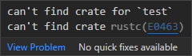

# Can't find crate for \`test\`

When creating an embedded no_std application for a CPU architecture that does not have an implementation of the standard library, rust-analyzer may mysteriously complain that it can't find the test crate. This has something to do with how rust-analyzer checks the code against all targets and tries to pull in test, which depends on std.



The fix is to tell VS Code to only invoke rust-analyzer for the architecture you are developing for. You can put this into `.vscode/settings.json`.

```javascript
{
    "rust-analyzer.checkOnSave.allTargets": false,
    "rust-analyzer.checkOnSave.extraArgs": [
        "--target",
        "thumbv7em-none-eabi"
    ]
}
```

# References
- https://github.com/rust-lang/rust-analyzer/issues/3801
